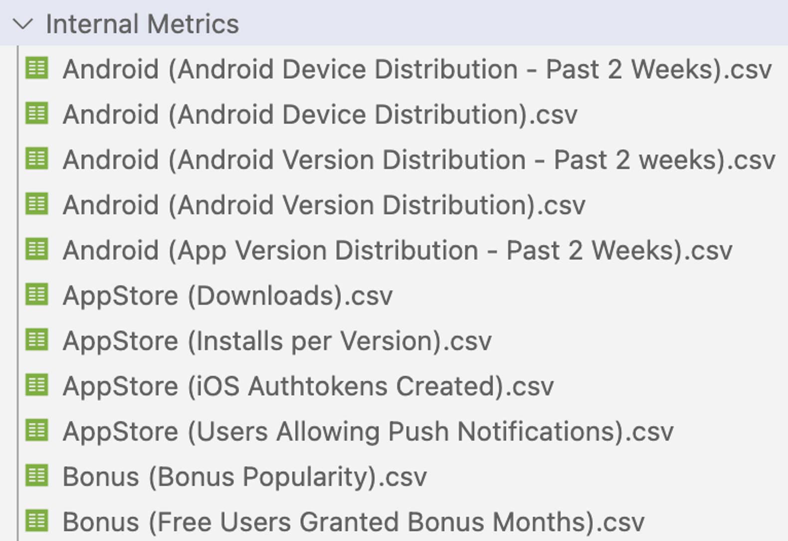
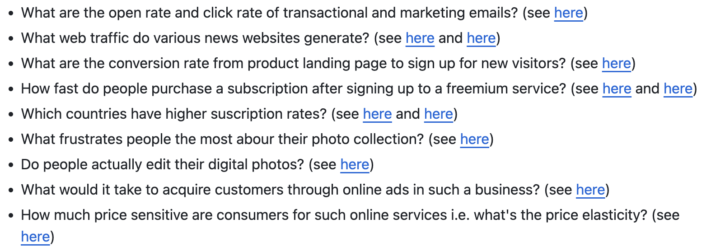

# Small Project Proposal

### Introduction

Everpix started in 2011 to fix the problem of organizing people's photo collections with smart engineering and design. The company raised $2.3 million from investors.

After two years of research and developing our product, they had a loyal group of early users and good publicity, but they couldn't get more funding in a competitive market. So, they announced their closure on November 5th, 2013.

To share their experience as startup, they compiled a large dataset about their business and upload it to GitHub. Inside the dataset, There are structured data like Internal Metrics and External Metrics, semi structured data like Press Coverage and Public Feedback, and the other unstructured data like investor reports and presentation slides.

I will utilise this dataset to analyze Everpix from several perspective.

### Business Problem and Technical Challenge

I will consider myself as a VC at October, 2013 to determine whether I will invest Everpix based on the metrics and reports. I need to figure out the answers for following questions as indicated in Github as common questions for startups:

Beside the investment decision, I also want to accelerate the digitalisation process of our company by building a framework using LLM to automate the whole analysis process. Therefore, I need to transform following csv file into a database, and also develop some text analysis.

### Scope of Work & Analytics Method

1. Build a framework to digitalise the document automatically: develop a Jupyter Notebook to ask LLM to transform all the structured data and semi-structured data from file to Data Repositories ****automatically.
2. Deploy a Text2SQL framework Vanna to query the data repositories.
3. Convert reports to vector database as knowledge base of the RAG.
4. Building a RAG with above vector database as well as using Text2SQL as agent.

### Key Deliverables

- A framework to digitalise structured data and semi-structured data automatically.
- A RAG to answer question about Everpix intelligently
- A report on the analysis on Everpix.

### Reference

[everpix/Everpix-Intelligence: Uncensored Everpix metrics, financials and business data for your perusing (github.com)](https://github.com/everpix/Everpix-Intelligence)

[vanna-ai/vanna: 🤖 Chat with your SQL database 📊. Accurate Text-to-SQL Generation via LLMs using RAG 🔄. (github.com)](https://github.com/vanna-ai/vanna)
